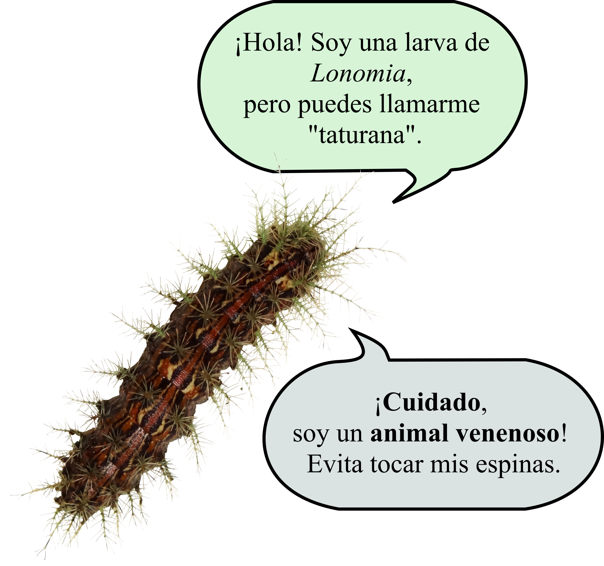
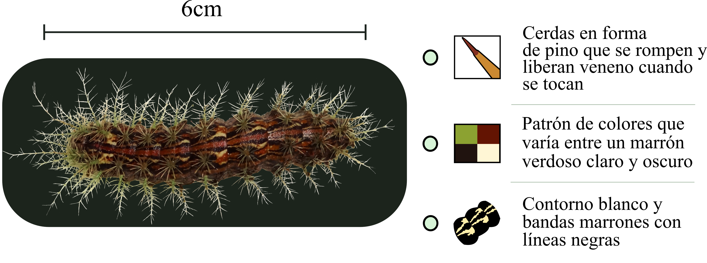

# LONOMISMO EN ARGENTINA

Se denomina lonomismo al cuadro clínico de envenenamiento que se desencadena tras el contacto accidental con orugas del género *Lonomia*, conocidas en la región del NEA como "taturanas".

## ¿QUE SON?

Las orugas son las larvas de las mariposas diurnas y nocturnas (polillas).  

Las orugas conocidas como TATURANA pertenecientes al género *Lonomia*, llegan a tener un máximo de 7cm de longitud, son de color marrón verdoso, con manchas blancas amarillentas. Poseen el cuerpo cubierto de espinas verdosas en forma de pino que contienen en su interior componentes tóxicos. Éstos, una vez en contacto con el ser humano, pueden llegar a ocasionar graves trastornos a la salud, inclusive la muerte.

Durante la noche se alimentan de las hojas de los árboles, y durante el día descansan sobre el tronco en colonias de varios individuos que se mimetizan fácilmente con el entorno.

## *¿QUE CAUSAN?*

**Los accidentes** se producen al rozarlas o tocarlas y pueden causar:

-   Dolor local

-   Ardor tipo quemadura

-   Urticaria

-   Hinchazón

-   Dolor de cabeza

-   Náuseas

-   Sangrado de heridas ya existentes

-   Sangrado de encías, nariz u otros

-   Agravándose con falla renal y hemorragias internas que **pueden llevar a la muerte**

## *¿QUE HACER EN CASO DE ACCIDENTE CON ORUGAS?*

¡**CON PRECAUCIÓN**! en la medida de lo posible y con ayuda de un palito, junte en un frasco limpio un ejemplar que causó el accidente o tome una foto para ayudar al diagnóstico médico. El frasco debe contener una etiqueta con la siguiente información: su nombre, un teléfono de contacto, fecha y lugar.

-   Lavar la zona afectada con abundante agua.

-   Puede aplicar compresas frías para aliviar momentáneamente el dolor y el ardor.

-   CONCURRA AL CENTRO DE SALUD MÁS CERCANO.

-   Hospital de referencia para el tratamiento: Hospital SAMIC de Puerto Iguazú (Misiones).

## ¡Atención!

Si ha tenido un accidente o ha encontrado taturanas, por favor póngase en contacto con:

- 📞: +54 9379-4635223 | +54 9 379-4604463 (llamadas/mensajes de texto/whatsapp/telegram)

- 📧:    [lonomiasargentinas@gmail.com](mailto:lonomiasargentinas@gmail.com)

- 📷: [instagram.com/lonomiasargentinas](https://www.instagram.com/lonomiasargentinas/)
